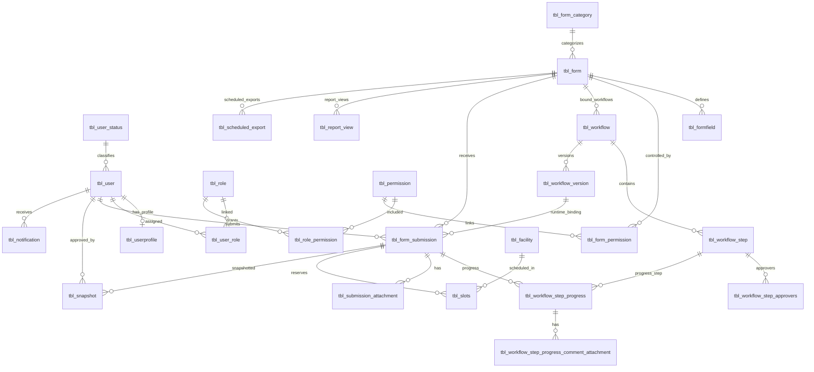

# AUFlow Data Model

This document describes the current implemented domain model and the canonical entity relationships used by AUFlow.

## Core Modeling Principles

- Core tables use the `tbl_` prefix.
- `tbl_form_submission` is the canonical runtime record for submissions.
- Runtime workflow progression is version-bound through `workflow_version_id` and `tbl_workflow_version.steps_snapshot`.
- Snapshot and audit records are immutable at the database level (with additional model-level safeguards for snapshots).

## Relationship Overview

## Identity and Access Control

### `tbl_user_status`
- User state catalog (`Active`, `Inactive`, `Archive` style states).

### `tbl_user`
- Primary key: `account_id`.
- Auth fields: `username`, `email`, `password`.
- Security field: `must_change_password`.
- FK to `tbl_user_status` via `user_status_id`.

### `tbl_userprofile`
- One-to-one profile extension for each account.
- Personal fields (names, IDs, contact details, profile picture path).

### `tbl_role`, `tbl_permission`, `tbl_role_permission`, `tbl_user_role`
- Role-permission and user-role pivot model.
- Authorization throughout app resolves permission slugs, not role names.

## Form Definition Domain

### `tbl_form_category`
- Form category catalog.

### `tbl_form`
- Core form metadata (`form_name`, `form_code`, status, versioning, locking).
- Revision lineage fields:
  - `form_family_code`
  - `parent_form_id`
  - `revision_effective_at`
- Sensitive field configuration:
  - `sensitive_fields` (JSON)

### `tbl_formfield`
- Dynamic form schema entries.
- Stores type, required flag, options, conditional metadata, order.

### `tbl_form_permission`
- Associates forms with permission IDs for form-level access.

## Workflow Definition and Runtime

### `tbl_workflow`
- Workflow metadata bound to forms.
- Stores status (`Draft`, `Active`, `Archived`) and workflow settings JSON.

### `tbl_workflow_step`
- Design-time steps for a workflow.
- Includes `step_group`, `step_order`, assignment and condition fields.

### `tbl_workflow_step_approvers`
- Multi-approver mapping per step.

### `tbl_workflow_version`
- Frozen publish snapshots.
- Key fields:
  - `workflow_id`
  - `version_number`
  - `steps_snapshot` (JSON)
  - `is_current`

### `tbl_workflow_step_progress`
- Runtime status rows per submission and step.
- Tracks state transitions and timing (`status`, `started_at`, `acted_at`, `completed_at`, `duration_seconds`).
- Uses `workflow_version_id` for snapshot-aware runtime logic.

### `tbl_workflow_step_progress_comment_attachment`
- Attachments on review/approval comments.

## Canonical Submission Domain

### `tbl_form_submission`
- Canonical source-of-truth table.
- Key fields:
  - `form_id`, `account_id`
  - `workflow_version_id`
  - `idempotency_key`
  - `submission_status`, `current_workflow_status`
  - `payload_json` (plain JSON array; no application-level encryption)
  - `schema_snapshot_json`
  - revision lineage (`revision_of`, `root_submission_id`, `is_latest_revision`)
- Generated virtual columns:
  - `v_student_id`
  - `v_department_code`

### `tbl_submission_attachment`
- Files associated with a canonical submission.
- Current normalized columns include:
  - `submission_id`
  - `original_name`
  - `file_path`
  - `mime_type`
  - `uploaded_by`

### `tbl_facility` and `tbl_slots`
- Facility catalog and per-submission booking/slot records.

## Snapshot and Audit Domain

### `tbl_snapshot`
- Immutable verification record table.
- Key fields:
  - `public_id`
  - `submission_id`
  - `payload_json`
  - `action_hash`
  - `rendered_html_path`
  - `locked`
- `rendered_html` column was removed; object storage path is used instead.

### `tbl_audit_log`
- Append-only audit stream.
- Update/delete blocked by DB triggers.

## Notifications and Reporting

### `tbl_notification`
- In-app notification table.
- Includes dedupe support via `idempotency_key`.

### `tbl_report_view`
- Saved report filters/views per form and user.

### `tbl_scheduled_export`
- Scheduled report export configuration and cadence metadata.

## Lifecycle Notes

- Legacy organization tables and legacy profile organization columns were removed (cleanup migration retained as no-op marker).
- Runtime submission dependencies now point to canonical submission IDs directly.
- Workflow runtime paths include compatibility fallback for pre-version records, but current create/publish flows use workflow versions.
